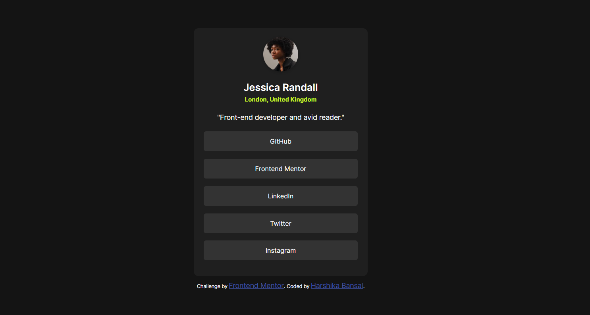
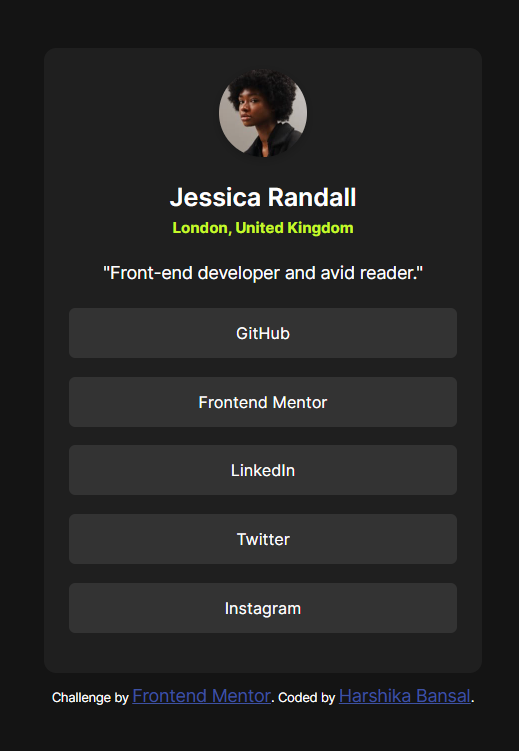
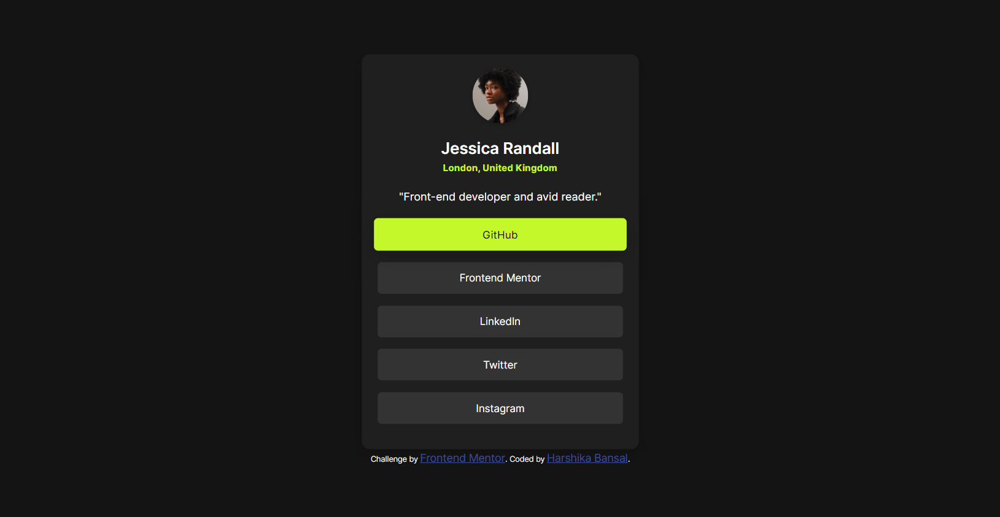

# Frontend Mentor - Social Links Profile



## 👋 Welcome!

This is my solution to the **Social Links Profile** challenge on [Frontend Mentor](https://www.frontendmentor.io). It's a beginner-level project that involves creating a responsive personal profile card with social links and hover/focus states.

---

## 🚀 Live Preview

- 🔗 **Live Site**: [LIve Preview](https://social-links-profile-hb.vercel.app/)
- 📂 **Challenge Link**: [Frontend Mentor Challenge](https://www.frontendmentor.io/challenges/social-links-profile-UG32l9m6d)
- 💻 **Coded by**: Harshika Bansal

---

## 🧠 What I Learned

While building this project, I improved my understanding of:

- Structuring semantic HTML
- Styling with custom CSS variables
- Importing and using local fonts via `@font-face`
- Creating reusable button components with hover and focus states
- Applying smooth transitions and hover effects
- Responsive design using media queries and flexbox

---

## 🛠️ Built With

- HTML5
- CSS3 (Vanilla)
- Local font (`Inter`) using `@font-face`
- Flexbox
- Mobile-first responsive design

---

## 📁 Folder Structure

```
├── assets
│ ├── fonts
│ └── images
├── design
│ ├── active-states.png
│ ├── desktop-design.png
│ └── mobile-design.png
├── index.html
├── style.css
├── preview.png
├── README.md
```

---

## 📐 Design

These are the screenshots of the website in desktop, mobile and active status preview.

| Desktop Design                                 | Mobile Design                                | Active States                                |
| ---------------------------------------------- | -------------------------------------------- | -------------------------------------------- |
|  |  |  |

---

## ✅ Features

- Fully responsive layout (mobile & desktop)
- Local font integration
- Accessible buttons with focus indicators
- Hover animations and interactive states
- Clean and modern UI

---

## 🧪 Getting Started

To run this project locally:

1. Clone the repository
2. Open `index.html` in your browser
3. Done! No build tools required

---

## 🤝 Acknowledgments

- Challenge by [Frontend Mentor](https://www.frontendmentor.io)
- Fonts provided via local files from the challenge starter pack

---

## 💬 Feedback

I’d love to hear your feedback or suggestions to improve this project! You can reach me via GitHub or LinkedIn.

---

**Have fun coding!** 🎉
